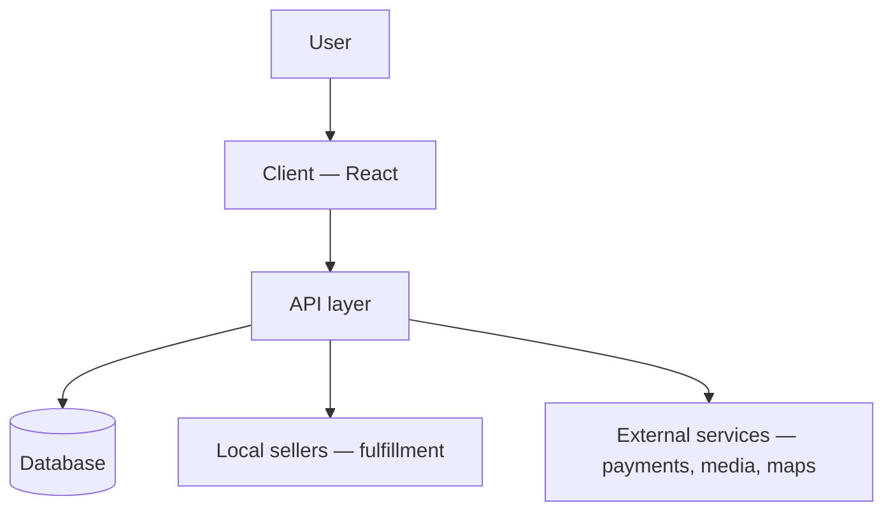
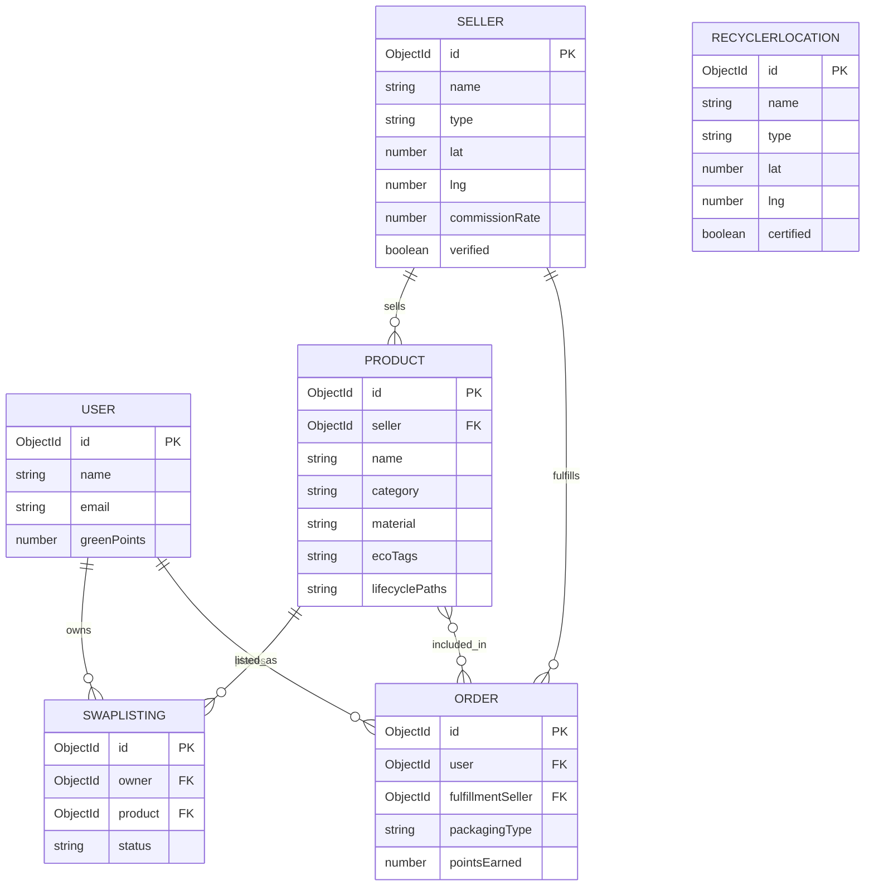

# Mangalams

**Traditional Indian fashion & gifts, reimagined as a circular economy.**

Mangalams is a marketplace for traditional and festive Indian wear and gifts, built on a single structural choice that differentiates it from every major player in Indian e-commerce: decentralize instead of centralize. Local sellers are the supply chain, not a legacy channel to route around — and every product is designed to be reused, not discarded.

---

## The opportunity

India's e-commerce and quick-commerce boom solved for convenience but created five compounding, measurable problems. Mangalams is positioned to address all five at once, because they share one root cause — centralized, disposable-by-design commerce.

| Problem | Scale in India | Root cause |
|---|---|---|
| Textile waste | ~70.7M tonnes/year generated nationally | Overproduction — far more manufactured than worn |
| Plastic | ~9.4M tonnes/year, ~26,000 tonnes/day | Synthetic fabric + inconsistent packaging practices |
| E-waste | 1.7M+ tonnes/year official, 5M+ tonnes/year estimated, ~80% informally handled | Short device lifecycles, weak formal recycling infrastructure |
| Delivery culture | One quick-commerce player alone projects 863M orders in 2026 | Instant delivery normalizes impulse buying and constant short-haul trips |
| Local retail displacement | 46% of quick-commerce users buying less from kirana stores | Centralized dark-store networks out-capitalize local shops |

No competitor addresses more than one or two of these at a time. That gap is the opening.

---

## Our solution

- **Circularity engine** — every eligible item can be bought, rented, or swapped, with a take-back path back into the loop. Wedding and festive wear, typically worn once, is the priority category.
- **Local-first fulfillment** — no platform-owned warehouses or dark stores. Orders route to the nearest verified local seller, the structural inverse of the quick-commerce model.
- **Plastic-free by default** — not an opt-in, and natural fibers (cotton, khadi, silk, jute) prioritized across the catalog.
- **Impact Hub** — a public directory connecting users to certified e-waste and recycling points, extending the mission beyond our own product categories.
- **Green Points** — a loyalty layer rewarding renting, swapping, and sustainable packaging choices, tying every feature into one retention loop.

---

## Competitive positioning

| Incumbent | Their model | Where Mangalams differs |
|---|---|---|
| Amazon / Flipkart | Centralized warehousing, overproduction-driven catalog | Circular by design — rent/swap/take-back built in, not bolted on |
| Blinkit / Zepto / Instamart | Owned dark-store networks, speed-optimized | No owned inventory footprint — local sellers fulfill, shorter delivery distances by nature |
| D-Mart-style large retail | Centralized bulk retail | Decentralized network of local/artisan sellers as the actual supply |

---

## Product architecture

The architecture is intentionally a single, unified system rather than a fragmented set of services — appropriate for an early-stage platform where speed of iteration matters more than premature scale.

- **Client** is the only user-facing surface — shop, rent, swap, and Impact Hub all live in one application.
- **API layer** is the sole point of business logic: authentication, catalog, order matching, and points calculation all pass through it.
- **Local sellers** are treated as a first-class architectural branch, not an integration afterthought — this is what makes the local-first fulfillment model real rather than aspirational.
- **External services** (payments, media storage, mapping) are kept at the edge, swappable without touching core logic.
- **Database** is a single connected store — no premature service-splitting, no data silos between features.

---

## Database design & connectivity

**How the collections connect:**

- Every **Product** belongs to a **Seller** — there is no platform-owned inventory anywhere in the schema. This is the data-level enforcement of the local-first model, not just a policy.
- **Order** references both the **User** who placed it and the **Seller** who fulfills it, matched by geographic proximity at checkout — the same connectivity pattern that powers the Impact Hub's recycler lookup.
- **SwapListing** links a **User** to a **Product**, forming the circularity loop independently of the buy/sell path.
- **RecyclerLocation** is intentionally disconnected from the commerce graph — it's a public utility layer, not a transactional one, and is queried the same way as Sellers (geo-proximity) so both can share one map interface.
- A single connected database is sufficient at this stage: the read/write patterns are simple lookups and geo-queries, not the kind of independent scaling load that would justify splitting data stores this early.

---

## Lean build strategy

Every core dependency has a zero-cost tier sufficient through MVP and early traction — database, hosting, media storage, maps, and payment sandboxing all included. This keeps the platform capital-efficient before any funding or revenue is required to sustain it, letting validation happen before infrastructure spend does.

Revenue model: commission-based marketplace, with the seller take-rate published openly rather than opaque — itself a point of differentiation against platforms criticized for squeezing sellers.

---

## Roadmap

| Phase | Focus |
|---|---|
| 1 — MVP | Core catalog with eco-tagging, local-seller-linked inventory, plastic-free packaging default |
| 2 | Rent/swap engine — weddings first, kids' wear next |
| 3 | Green Points — ties checkout, rentals, and swaps into one retention loop |
| 4 | Impact Hub — recycler and local-seller directory on a shared map |

Each phase is additive — nothing built in Phase 1 needs to be reworked as later phases land.

---

## Why now

India's retail displacement and waste problems are accelerating in parallel, not separately — the same centralization pattern driving textile and plastic waste is also hollowing out local retail livelihoods. A platform built to solve one of these problems structurally solves the others. That's the thesis, and the architecture above is built to prove it.
